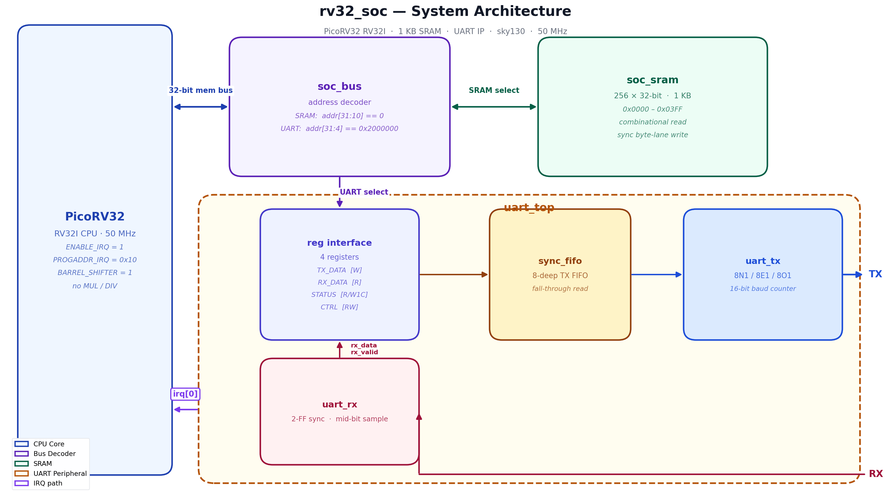
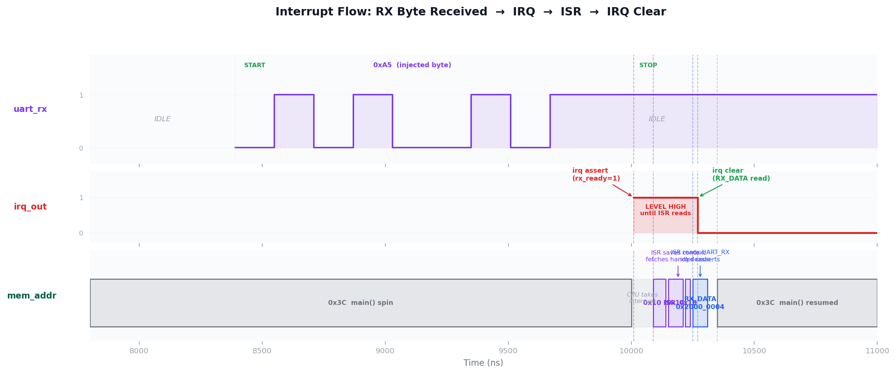

<h1 align="center">rv32_soc</h1>

<p align="center">
  A <strong>PicoRV32 RV32I CPU</strong>, 1 KB SRAM, and a memory-mapped UART peripheral —<br>
  integrated into a complete SoC, verified end-to-end in simulation,<br>
  and taken all the way to a silicon layout (GDS) on the <strong>SkyWater 130 nm</strong> open process.
</p>

<p align="center">
  
  
  
  
  
  
</p>

<br>

<p align="center">
  
</p>

---

## What we built

A small computer on a chip, designed from scratch in hardware description language (Verilog) and manufactured on real silicon.

The chip has a **CPU** that runs code, a **memory** that stores it, and a **UART** — a standard interface that lets the chip send and receive bytes over a serial wire (the same way a microcontroller talks to a terminal).

When you send a byte to the chip, the hardware detects it, interrupts the CPU, and the CPU reads and echoes it back — entirely in hardware, with no operating system, no libraries, nothing external.

Every part of that path — from the serial wire all the way through hardware logic, interrupt, software handler, and back — is implemented here and verified in simulation.

---

## What makes this project interesting

This isn't a tutorial — it's a complete, working SoC designed from first principles.

- **End-to-end interrupt path** — a byte arrives electrically on a pin, the hardware FSM decodes it, the CPU jumps to an ISR, the ISR reads a register, the interrupt deasserts — every step is implemented in RTL and verified in simulation
- **Firmware on a synthesisable CPU** — not a testbench driving registers directly; real firmware (`start.S`, `main.c`) runs on PicoRV32, with the interrupt vector, context save/restore, and `retirq` all hand-encoded
- **Physical design closure** — full OpenLane flow: synthesis → placement → clock tree → routing → STA → DRC → LVS → GDS, targeting sky130 HD standard cells

---

## The three data paths

| Path | Hardware traversed | Verified by |
|---|---|---|
| **Instruction fetch** | PicoRV32 → `soc_bus` → `soc_sram` → back | `soc_top_tb` test 1 — first fetch at `0x0` within 20 cycles |
| **UART transmit** | firmware `SW` → `soc_bus` → `uart_top` FIFO → `uart_tx` FSM → TX pin | `soc_top_tb` test 2 — `'U'` (0x55) and `'V'` (0x56) decoded from pin |
| **Interrupt** | RX pin → 2-FF sync → `uart_rx` FSM → `irq[0]` → PicoRV32 ISR → `RX_DATA` read → IRQ clear | `soc_top_tb` tests 3 & 4 — assert then clear confirmed |

---

## Signal traces

### CPU instruction fetch

<p align="center">
  
</p>

`mem_valid` and `mem_ready` pulse together for exactly one clock — zero wait states. `mem_addr` steps through the firmware PC. `mem_rdata` returns the instruction combinationally: the first word is `0x01C0_006F` (`JAL x0, _start`).

---

### UART write transaction

<p align="center">
  
</p>

Each `SW` instruction from firmware is a single-cycle bus write. `soc_bus` routes the access to `uart_top` based on `addr[31:4] == 0x2000000`. Two writes go to `TX_DATA` (`'U'`, `'V'`), one to `CTRL` to arm the interrupt. The UART serialiser starts within 2 clocks of the first write.

---

### UART serial protocol & FIFO burst

<table align="center"><tr>
<td align="center" width="50%">
  <br>
  <sub><b>8N1 frame — 0xA5.</b> Mid-bit sampling markers (▼) show where the RX FSM samples each bit. <code>rx_valid</code> is a single-clock pulse.</sub>
</td>
<td align="center" width="50%">
  <br>
  <sub><b>FIFO burst — 4 bytes back-to-back.</b> The serialiser drains the FIFO with a 2-clock gap between frames. Without the FIFO the CPU would spin-wait ~4340 cycles per byte.</sub>
</td>
</tr></table>

---

### Interrupt flow

<p align="center">
  
</p>

Four phases separated by dashed markers: **(1)** `uart_rx` frame completes → `irq_out` asserts; **(2)** CPU finishes current instruction, saves `PC → x3`, jumps to `0x10`; **(3)** ISR reads `RX_DATA` at `0x2000_0004` → `irq_out` falls within 2 clocks; **(4)** `retirq` restores context, `main()` resumes at `0x3C`.

---

## Verification

<table align="center">
<tr>
<td valign="top" width="50%">

**UART IP unit tests** (`uart_top_tb.v`)
Drives the register interface directly — no CPU.

| # | Test | Status |
|---|---|:---:|
| 1 | 8N1 loopback — 5 bytes | ✅ |
| 2 | 8E1 even parity | ✅ |
| 3 | 8O1 odd parity | ✅ |
| 4 | FIFO burst — 4 bytes back-to-back | ✅ |
| 5 | Framing error inject + W1C clear | ✅ |
| 6 | STATUS register after idle | ✅ |

</td>
<td valign="top" width="50%">

**SoC system tests** (`soc_top_tb.v`)
Firmware runs on real CPU; bus events monitored.

| # | Test | Status |
|---|---|:---:|
| 1 | CPU boots — first fetch at `0x0` | ✅ |
| 2 | UART TX — `'U'` and `'V'` on wire | ✅ |
| 3 | IRQ asserts after byte received | ✅ |
| 4 | ISR clears IRQ; CPU resumes | ✅ |

</td>
</tr>
</table>

> **Key insight — persistent monitors:** the CPU executes ~40 instructions in the time UART serialises one byte. A testbench polling loop that opens after waiting for UART will miss bus events that already happened. All bus checks use `always @(posedge clk)` blocks that latch events into sticky flags from `time 0` — the test then checks the flag, which holds its value indefinitely.

```bash
cd tb && make all   # runs both testbenches; prints PASS/FAIL per assertion
```

---

## Physical design

<p align="center">
  
</p>

<p align="center">
  <sub>uart_tx module after full place-and-route on sky130 HD. Horizontal stripes: VDD/VSS rails. Dense tiles: logic gates and flip-flops. Vertical lines: metal routing.</sub>
</p>

<br>

<table align="center">
<tr>
  <th>Module</th>
  <th>Cells</th>
  <th>Die area</th>
  <th>Flow</th>
</tr>
<tr>
  <td><code>uart_tx</code></td>
  <td>~40</td>
  <td>— (standalone)</td>
  <td rowspan="3">Yosys → OpenROAD → OpenSTA → Magic DRC → Netgen LVS → GDS</td>
</tr>
<tr>
  <td><code>uart_top</code></td>
  <td>145</td>
  <td>60 × 71 µm</td>
</tr>
<tr>
  <td><code>soc_top</code> (full SoC)</td>
  <td>~8 400</td>
  <td>dominated by 8192-DFF SRAM array</td>
</tr>
</table>

Key synthesis flags: `SYNTH_STRATEGY AREA 1` prevents the SRAM DFF array from being duplicated for retiming; `FP_CORE_UTIL 35%` gives the router headroom for the large cell count.

---

## Design decisions

| Decision | Rationale |
|---|---|
| **Combinational SRAM read** | Zero wait states — `soc_bus` is purely combinational, no stall path needed |
| **Level-sensitive IRQ** | `irq = irq_en & rx_ready` — stays HIGH until ISR reads `RX_DATA`; PicoRV32 re-enters ISR if not cleared, which is the correct behaviour |
| **Fall-through FIFO** | `rd_data` is combinational from the array — `uart_tx` sees the next byte one clock earlier, no latency bubble |
| **W1C error flags** | ARM AMBA convention — reading STATUS cannot accidentally clear `frame_err` or `parity_err`; only an explicit write-1 clears them |
| **2-FF synchronisers** | Both `uart_rx` input and `rst_n` deassertion go through a 2-FF chain before touching any clocked logic |
| **Python firmware encoder** | `firmware.py` produces the exact same hex as GCC — no cross-compiler needed to run the simulation |

---

## Bugs found during development

| Bug | What was observed | Root cause | Fix |
|---|---|---|---|
| **IRQs never delivered** | `irq_out` went HIGH; CPU never jumped to `0x10` | `picorv32.v` resets `irq_mask = ~0` (all masked). `|(irq_pending & ~irq_mask)` was always 0 | Firmware executes `maskirq x0, x0` (`0x0600_000B`) before spin loop |
| **Testbench false failures** | "firmware never wrote UART_CTRL" — timeout | CPU wrote CTRL at cycle 44; testbench polling loop opened at cycle ~600 | Replaced all bus-event polls with persistent `always @(posedge clk)` sticky-flag monitors |

---

## Repository

```
rv32_soc/
├── rtl/               ← 8 Verilog modules (picorv32, soc_top/bus/sram, uart_top/tx/rx, sync_fifo)
├── tb/                ← uart_top_tb.v (6 tests)  +  soc_top_tb.v (4 tests)
├── firmware/          ← start.S · uart_drv.h · main.c · link.ld · firmware.py · firmware.hex
├── docs/images/       ← all diagrams and waveforms (PNG/SVG)
└── openlane/soc/      ← config.json · soc_top.sdc · pin_order.cfg
```

---

## Quick start

```bash
git clone https://github.com/TheAsaf/RISC-V-SoC-Sky130.git && cd RISC-V-SoC-Sky130

# Simulate  (requires Icarus Verilog)
cd tb && make all

# View waveforms in GTKWave
make wave && make soc_wave

# Build firmware without a RISC-V toolchain
cd ../firmware && make python

# Regenerate diagrams and waveforms
cd ../docs && python3 gen_soc_visuals.py && python3 gen_waveforms.py
```

<br>
<p align="center"><sub>Icarus Verilog · OpenLane · SkyWater 130 nm · PicoRV32 · Python</sub></p>
