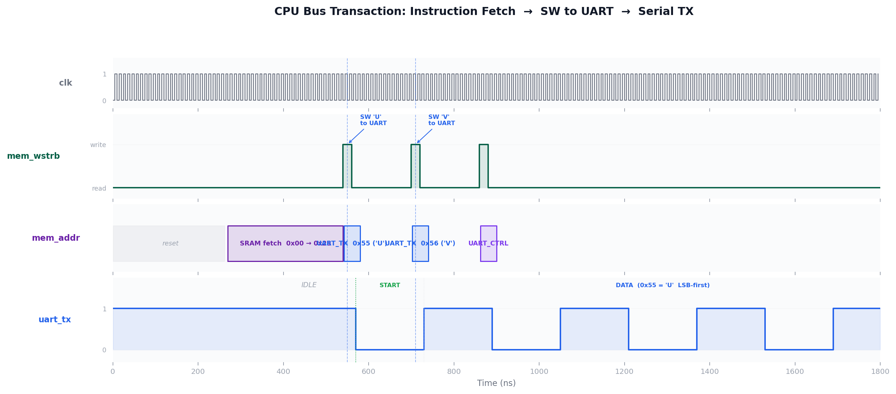

<h1 align="center">rv32_soc</h1>

<p align="center">
  <strong>A complete RISC-V SoC from RTL to GDS — PicoRV32 CPU · 1 KB SRAM · UART IP · sky130</strong>
</p>

<p align="center">
  
  
  
  
  
</p>

---

## Quick Understanding

<p align="center">
  
</p>

- **CPU** — PicoRV32 RV32I core running firmware from 1 KB SRAM at 50 MHz
- **Bus** — `soc_bus` decodes the 32-bit address, routes SRAM reads and UART register writes
- **UART** — register-mapped peripheral with 8-deep TX FIFO, parity, and interrupt output
- **Interrupt** — when a byte arrives on RX, `irq[0]` fires; ISR reads `RX_DATA` and clears it
- **Silicon** — full RTL-to-GDS flow on sky130 HD cells via OpenLane; DRC and LVS clean

---

## Architecture

The SoC has four Verilog modules connected by a single shared bus:

| Module | Role | Address |
|---|---|---|
| `picorv32` | RV32I CPU, ENABLE_IRQ=1, BARREL_SHIFTER | — |
| `soc_bus` | Combinational address decoder + rdata mux | — |
| `soc_sram` | 256 × 32-bit behavioral SRAM, comb. read | `0x0000 – 0x03FF` |
| `uart_top` | TX FIFO + serialiser + receiver + IRQ | `0x2000_0000 – 0x2000_000F` |

**UART registers:**

| Offset | Name | Access | Function |
|---|---|---|---|
| `+0x0` | TX_DATA | W | Push byte to TX FIFO |
| `+0x4` | RX_DATA | R | Read received byte (clears `rx_ready`) |
| `+0x8` | STATUS | R/W1C | `tx_busy`, `fifo_full/empty`, `rx_ready`, `frame_err`, `parity_err` |
| `+0xC` | CTRL | RW | `irq_en`, `parity_odd`, `parity_en` |

<p align="center">
  
</p>

---

## How It Works

### 1 — CPU Executes Firmware

After reset, PicoRV32 fetches its first instruction from address `0x0000_0000`. The firmware (`start.S`) jumps to `_start`, zeroes BSS, calls `main()`, then executes `maskirq x0, x0` to unmask interrupts.

`main()` polls the UART status register and transmits a boot banner byte-by-byte using a tight spin loop on `FIFO_FULL`. This is the polled TX path:

```
CPU: SW a1, 0(x1)           ← writes 0x55 ('U') to UART_TX at 0x20000000
soc_bus: uart_wen = 1       ← detects UART select + wstrb != 0
uart_top: push to sync_fifo ← byte enters 8-deep TX FIFO
uart_tx: serialises         ← START bit + 8 data bits + STOP bit
```

<p align="center">
  
</p>

The waveform shows three phases: CPU instruction fetch from SRAM, the `SW` instruction writing 'U' then 'V' to the UART TX register, and the UART serialiser immediately driving the start bit onto the TX line.

### 2 — UART Serial Protocol

Each byte is framed as an 8N1 (or 8E1 / 8O1) frame at 115200 baud. The RX path has a 2-FF metastability synchroniser on the input pin before any logic touches it.

<p align="center">
  
</p>

The RX FSM waits for the start bit falling edge, advances to the mid-bit point (`CLKS_PER_BIT / 2`), then samples once per bit period. The `▼` markers show exactly where the hardware samples.

<p align="center">
  
</p>

When 4 bytes are loaded into the TX FIFO back-to-back, the serialiser drains them with only a 2-clock gap between frames — no software involvement needed.

### 3 — Interrupt Flow

`irq = irq_en & rx_ready` — a purely combinational signal. When a byte completes reception, `rx_ready` asserts and `irq[0]` goes HIGH. PicoRV32 saves `PC → x3`, pending bitmap `→ x4`, and jumps to `PROGADDR_IRQ = 0x10`. The ISR reads `UART_RX`, which clears `rx_ready` and deasserts the IRQ.

<p align="center">
  
</p>

The waveform shows the complete sequence from byte injection on `uart_rx`, through IRQ assertion, the CPU jumping to the ISR at `0x10`, the ISR reading `RX_DATA` at `0x2000_0004`, and the IRQ clearing within 3 clock cycles of that read.

---

## Simulation Results

```
=== UART IP Unit Tests (6 tests) ===
  PASS: 8N1 loopback  — 5 bytes (0xA5, 0x00, 0xFF, 0x55, 0xAA)
  PASS: 8E1 even parity
  PASS: 8O1 odd parity
  PASS: FIFO burst (4 bytes back-to-back)
  PASS: Framing error injection + W1C clear
  PASS: Status register idle check

=== SoC System Tests (4 tests) ===
  PASS: CPU boot — first fetch at 0x0 within 20 cycles
  PASS: UART TX — 'U' (0x55) and 'V' (0x56) decoded on uart_tx pin
  PASS: IRQ assertion — irq_out HIGH after 0xA5 injected on uart_rx
  PASS: IRQ clear — ISR read RX_DATA; irq_out LOW; CPU resumed

ALL TESTS PASSED (10 / 10)
```

Run locally:

```bash
cd tb
make all     # compile and run both testbenches
make wave    # open UART VCD in GTKWave
make soc_wave
```

---

## Physical Design

<p align="center">
  
</p>

The image shows the `uart_tx` module after full place-and-route on sky130 HD standard cells. Horizontal stripes are VDD/VSS power rails. The dense rectangular tiles are logic gates (AND, OR, DFF). Vertical routing is metal interconnect.

The full `uart_top` module fits in a 60 × 71 µm die area with 145 cells. The complete SoC (`uart_top` + PicoRV32 + behavioral SRAM) contains ~8 400 cells, dominated by the 8192-DFF SRAM array.

**Flow:**

```
Yosys (synthesis) → floorplan → placement → CTS → routing → STA → DRC → LVS → GDS
```

```bash
cd openlane/soc
flow.tcl -design .     # requires OpenLane installed
```

Key config choices: `SYNTH_STRATEGY AREA 1` prevents Yosys duplicating the SRAM DFF array for retiming; `FP_CORE_UTIL 35%` gives the router room for the large cell count.

---

## Key Design Decisions

- **Combinational SRAM read** — zero wait states; CPU achieves single-cycle fetch without a pipeline stall path
- **Level-sensitive IRQ** — `irq = irq_en & rx_ready`; if the ISR doesn't read `RX_DATA`, the CPU re-enters the ISR on the next instruction — this is intentional and correct
- **Fall-through FIFO** — `rd_data` is combinational; the uart_tx FSM sees the next byte without a clock cycle of latency
- **W1C error flags** — `frame_err` and `parity_err` follow ARM AMBA convention; a 1-bit set cannot be accidentally cleared by a read-modify-write of unrelated bits
- **2-FF synchronisers** — both the async `uart_rx` input and the `rst_n` deassertion edge go through a 2-FF chain before touching clocked logic
- **Python firmware encoder** — `firmware.py` generates the exact same hex as GCC with full RV32I encoding and self-check; no cross-compiler needed to run the simulation

---

## Bugs & Lessons

**Bug 1 — PicoRV32 starts with all IRQs masked**

`irq_mask` resets to `0xFFFF_FFFF` (all masked). The first simulation showed `irq_out` going HIGH but the CPU never entering the ISR. Diagnosis: added a bus monitor printing every transaction — confirmed the IRQ was asserted but `|(irq_pending & ~irq_mask)` was always 0. Fix: firmware must execute `maskirq x0, x0` (`0x0600_000B`) before interrupts can be delivered.

**Bug 2 — Testbench polling loops miss transient events**

The CPU executes ~40 instructions in the time UART serialises one byte. Initial testbench polled for "firmware wrote UART_CTRL" in a loop that opened too late — the event had already happened. Fix: replaced all bus-event checks with persistent `always @(posedge clk)` monitors that latch events into sticky flags from `time 0`. The test then just reads the flag.

---

## Repository

```
rv32_soc/
├── rtl/
│   ├── picorv32.v          ← PicoRV32 CPU (upstream, MIT)
│   ├── soc_top.v           ← top-level integration + reset sync
│   ├── soc_bus.v           ← address decoder (pure combinational)
│   ├── soc_sram.v          ← 1 KB behavioral SRAM
│   ├── uart_top.v          ← UART register-mapped controller
│   ├── uart_tx.v           ← UART transmitter FSM
│   ├── uart_rx.v           ← UART receiver FSM + 2-FF sync
│   └── sync_fifo.v         ← parameterised synchronous FIFO
├── tb/
│   ├── uart_top_tb.v       ← UART unit test (6 tests)
│   └── soc_top_tb.v        ← SoC system test (4 tests)
├── firmware/
│   ├── start.S             ← reset vector, IRQ entry, BSS zero
│   ├── uart_drv.h          ← register definitions + inline driver
│   ├── main.c              ← boot banner + IRQ echo loop
│   ├── link.ld             ← linker script (reset @ 0x0, IRQ @ 0x10)
│   ├── firmware.py         ← Python RV32I encoder (no toolchain needed)
│   └── firmware.hex        ← pre-built firmware image
├── docs/
│   ├── images/             ← all diagrams and waveforms
│   ├── gen_soc_visuals.py  ← generates soc_architecture, bus, irq PNGs
│   ├── gen_waveforms.py    ← generates UART waveforms from VCD
│   └── gen_diagrams.py     ← generates architecture and register map SVGs
└── openlane/soc/
    ├── config.json         ← OpenLane flow configuration
    ├── soc_top.sdc         ← timing constraints
    └── pin_order.cfg       ← I/O placement
```

---

## Quick Start

```bash
# Clone and simulate (no toolchain required)
git clone https://github.com/TheAsaf/uart-vlsi-sky130.git
cd uart-vlsi-sky130

# Run all tests
cd tb && make all

# Regenerate waveform images
cd ../docs && python3 gen_waveforms.py
python3 gen_soc_visuals.py

# Build firmware (Python path — no RISC-V GCC needed)
cd ../firmware && make python
```

---

<p align="center">
  Made with Icarus Verilog · OpenLane · sky130 PDK · Python
</p>
